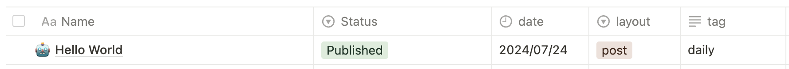

# 准备工作

## notion部分

*   注册账号

*   新建一个integration，用于对数据进行派生

    *   [进入页面](https://www.notion.so/my-integrations)

    *   选择对应的workspace

    *   填写其他信息，确认(记住这里的秘钥)

*   进入自己的database页面，设置中添加刚刚设置的collections

*   设置database的格式，有些字段是必须的

    *   `Status`字段必须，Published会将文章设置为可以进行部署，其他的可以自定义

    *   `date`字段必须，名称必须data，结果值必须为year-month-day

    *   `layout`字段必须为post，jekyll才能从meta进行识别

    *   `tag`字段任意。



## github部分

*   新建项目，注意如果不需要domain/blog这种后缀，需要设置名称为yourname.github.io

*   进入`settings`-`Security`-`Actions secrets and variables`

    *   新增刚刚的秘钥到 `NOTION_SECRET`

*   进入`settings`-`Pages`-`Build and deployment`

    *   设置为Github Actions

    *   后续如果自己申请了域名，可以这里进行设置

*   去网上找一些jekyll的模板，clone到该项目中。

*   编辑项目中的.github/workflows/action-jam.yml

    *   注意其中的databse\_id需要你自己创建后修改。

    ```yaml
    name: NotionJAM
    # Controls when the workflow will run
    on:
      schedule:
        - cron: "0 21 * * *" # daily
      push:
        branches: [master, main]
        paths-ignore:
          - .gitignore
          - README.md
          - LICENSE

      # Allows you to run this workflow manually from the Actions tab
      workflow_dispatch:

    permissions:
      contents: write
      pages: write
      id-token: write

    # Allow one concurrent deployment
    concurrency:
      group: "pages"
      cancel-in-progress: true

    # A workflow run is made up of one or more jobs that can run sequentially or in parallel
    jobs:
      # This workflow contains a single job called "build"
      init:
        # The type of runner that the job will run on
        runs-on: ubuntu-latest

        # Steps represent a sequence of tasks that will be executed as part of the job
        steps:
          # Checks-out your repository under $GITHUB_WORKSPACE, so your job can access it
          - uses: actions/checkout@v3

          - name: notion-jam
            uses: victornpb/notion-jam@v0.0.10
            with:
              NOTION_SECRET: ${{ secrets.NOTION_SECRET }}
              NOTION_DATABASE: https://www.notion.so/<your_database_id>
              FILTER_PROP: Status
              FILTER_VALUES: Published
              CONVERT_PROP_CASE: snake
              ARTICLE_PATH: _posts/2020-01-01-{id}.md
              ASSETS_PATH: ./assets/
              PARALLEL_PAGES: 25
              PARALLEL_DOWNLOADS_PER_PAGE: 3
              DOWNLOAD_IMAGE_TIMEOUT: 30
              SKIP_DOWNLOADED_IMAGES: true
              DOWNLOAD_FRONTMATTER_IMAGES: true
          
          - name: Save changes
            uses: stefanzweifel/git-auto-commit-action@v4
            with:
              commit_message: Commit changes
      
      build:
        runs-on: ubuntu-latest
        needs: init
        steps:
          - name: Checkout
            uses: actions/checkout@v4
            with:
              fetch-depth: 0

          - name: Setup Pages
            id: pages
            uses: actions/configure-pages@v4

          - name: Setup Ruby
            uses: ruby/setup-ruby@v1
            with:
              ruby-version: 3.3
              bundler-cache: true

          - name: Build site
            run: bundle exec jekyll b -d "_site${{ steps.pages.outputs.base_path }}"
            env:
              JEKYLL_ENV: "production"

          - name: Upload site artifact
            uses: actions/upload-pages-artifact@v3
            with:
              path: "_site${{ steps.pages.outputs.base_path }}"

      deploy:
        environment:
          name: github-pages
          url: ${{ steps.deployment.outputs.page_url }}
        runs-on: ubuntu-latest
        needs: build
        steps:
          - name: Deploy to GitHub Pages
            id: deployment
            uses: actions/deploy-pages@v4
    ```

## How to work

正如workflow中描述的那样，Github action会在每天21点（也可以自己点击）进行更新。

更新运行逻辑为：

*   先用jam将notion中的文章拉取为markdown格式到项目中（包括push)。

*   jekyll构建项目，将markdown转换为html，再进行打包。

*   jekyll部署打包文件到GithubPage静态页面。
