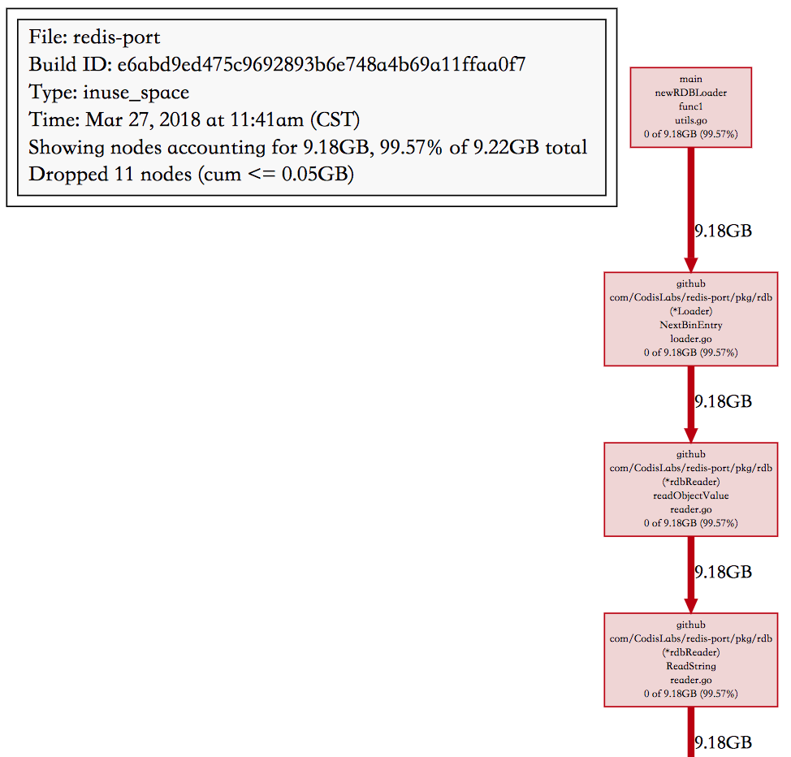

`Golang pprof`是Golang官方的profiling工具，非常强大，使用也比较方便。

我们在程序中嵌入如下几行代码，

```go
import _ "net/http/pprof"

go func() {
    http.ListenAndServe("0.0.0.0:8899", nil)
}()
```

在浏览器中输入`http://ip:8899/debug/pprof/`可以看到一个汇总页面，

```go
/debug/pprof/

profiles:
0    block
32    goroutine
552    heap
0    mutex
51    threadcreate

full goroutine stack dump
```

其中`heap`项是我们需要关注的信息，

```shell
heap profile: 96: 1582948832 [21847: 15682528480] @ heap/1048576
91: 1527472128 [246: 4129210368] @ 0x471d87 0x471611 0x4718cd 0x4689bf 0x50deb9 0x50d7ac 0x75893b 0x45d801
#    0x471d86    bytes.makeSlice+0x76                            /usr/local/go/src/bytes/buffer.go:231
#    0x471610    bytes.(*Buffer).grow+0x140                        /usr/local/go/src/bytes/buffer.go:133
#    0x4718cc    bytes.(*Buffer).Write+0xdc                        /usr/local/go/src/bytes/buffer.go:163
#    0x4689be    io.(*multiWriter).Write+0x8e                        /usr/local/go/src/io/multi.go:60
#    0x50deb8    github.com/CodisLabs/redis-port/pkg/rdb.createValueDump+0x198        go_workspace/src/github.com/CodisLabs/redis-port/pkg/rdb/loader.go:194
#    0x50d7ab    github.com/CodisLabs/redis-port/pkg/rdb.(*Loader).NextBinEntry+0x28b    go_workspace/src/github.com/CodisLabs/redis-port/pkg/rdb/loader.go:176
#    0x75893a    main.newRDBLoader.func1+0x23a                        go_workspace/src/github.com/CodisLabs/redis-port/cmd/utils.go:733
......
```

包括一些汇总信息，和各个go routine的内存开销，不过这里除了第一行信息比较直观，其他的信息太离散。可以看到当前使用的堆内存是1.58GB，总共分配过15.6GB。

```plain text
heap profile: 96(inused_objects): 1582948832(inused_bytes) [21847(allocated_objects): 15682528480(allocted_bytes)] @ heap/1048576
```

更有用的信息我们需要借助`go tool pprof`来进行分析，

```plain text
go tool pprof -alloc_space/-inuse_space http://ip:8899/debug/pprof/heap
```

这里有两个选项，-alloc\_space和-inuse\_space，从名字应该能看出二者的区别，不过条件允许的话，我们优先使用-inuse\_space来分析，因为直接分析导致问题的现场比分析历史数据肯定要直观的多，一个函数alloc\_space多不一定就代表它会导致进程的RSS高，因为我们比较幸运可以在线下复现这个OOM的场景，所以直接用-inuse\_space。

这个命令进入后，是一个类似`gdb`的交互式界面，输入`top`命令可以前10大的内存分配，`flat`是堆栈中当前层的inuse内存值，cum是堆栈中本层级的累计inuse内存值（包括调用的函数的inuse内存值，上面的层级），

```plain text
(pprof) top
Showing nodes accounting for 3.73GB, 99.78% of 3.74GB total
Dropped 5 nodes (cum <= 0.02GB)
Showing top 10 nodes out of 16
      flat  flat%   sum%        cum   cum%
    3.70GB 98.94% 98.94%     3.70GB 98.94%  bytes.makeSlice /usr/local/go/src/bytes/buffer.go
    0.03GB  0.83% 99.78%     0.03GB  0.83%  main.(*cmdRestore).Main /usr/local/go/src/bufio/bufio.go
         0     0% 99.78%     3.70GB 98.94%  bytes.(*Buffer).Write /usr/local/go/src/bytes/buffer.go
         0     0% 99.78%     3.70GB 98.94%  bytes.(*Buffer).grow /usr/local/go/src/bytes/buffer.go
         0     0% 99.78%     3.70GB 98.94%  github.com/CodisLabs/redis-port/pkg/rdb.(*Loader).NextBinEntry go_workspace/src/github.com/CodisLabs/redis-port/pkg/rdb/loader.go
         0     0% 99.78%     3.70GB 98.94%  github.com/CodisLabs/redis-port/pkg/rdb.(*rdbReader).Read go_workspace/src/github.com/CodisLabs/redis-port/pkg/rdb/reader.go
         0     0% 99.78%     3.70GB 98.94%  github.com/CodisLabs/redis-port/pkg/rdb.(*rdbReader).ReadBytes go_workspace/src/github.com/CodisLabs/redis-port/pkg/rdb/reader.go
         0     0% 99.78%     3.70GB 98.94%  github.com/CodisLabs/redis-port/pkg/rdb.(*rdbReader).ReadString go_workspace/src/github.com/CodisLabs/redis-port/pkg/rdb/reader.go
         0     0% 99.78%     3.70GB 98.94%  github.com/CodisLabs/redis-port/pkg/rdb.(*rdbReader).readFull go_workspace/src/github.com/CodisLabs/redis-port/pkg/rdb/reader.go
         0     0% 99.78%     3.70GB 98.94%  github.com/CodisLabs/redis-port/pkg/rdb.(*rdbReader).readObjectValue go_workspace/src/github.com/CodisLabs/redis-port/pkg/rdb/reader.go
```

可以看到大部分内存都是`bytes.makeSlice`产生的（flat 98.94%），不过这是一个标准库函数，再撸撸代码，往下看可以看到redis-port实现的函数`(*Loader).NextBinEntry`，这里推荐使用`list`命令

```plain text
(pprof) list NextBinEntry
Total: 3.74GB
ROUTINE ======================== github.com/CodisLabs/redis-port/pkg/rdb.(*Loader).NextBinEntry in go_workspace/src/github.com/CodisLabs/redis-port/pkg/rdb/loader.go
         0     3.70GB (flat, cum) 98.94% of Total
         .          .    137:           default:
         .          .    138:                   key, err := l.ReadString()
         .          .    139:                   if err != nil {
         .          .    140:                           return nil, err
         .          .    141:                   }
         .     3.70GB    142:                   val, err := l.readObjectValue(t)
         .          .    143:                   if err != nil {
         .          .    144:                           return nil, err
         .          .    145:                   }
         .          .    146:                   entry.DB = l.db
         .          .    147:                   entry.Key = key
```

可以直接看到这个函数在哪一行代码产生了多少的内存！不过如果是在可以方便导出文件的测试环境，推荐使用命令，

```plain text
go tool pprof -inuse_space -cum -svg http://ip:8899/debug/pprof/heap > heap_inuse.svg
```



这个可以得到前后调用关系的调用栈图，同时还包括每一层的inuse 内存大小，文件名，函数，到下一层的内存大小，分析起来简直不能再顺手。

最后定位原因就比较简单了，redis-port在解析RDB时，是按key为粒度来处理的，遇到大key时，value可能有好几个GB，然后redis-port直接使用了标准库`bytes.Buffer`来存储解析出来的value（对于redis hash来说是field，value对），Buffer在空间不够的时候会自己`grow`，策略是当前capacity 2倍的增长速度，避免频繁内存分配，看看标准库的代码（go 1.9）

```plain text
// grow grows the buffer to guarantee space for n more bytes.
// It returns the index where bytes should be written.
// If the buffer can't grow it will panic with ErrTooLarge.
func (b *Buffer) grow(n int) int {
......
    } else {
        // Not enough space anywhere, we need to allocate.
        buf := makeSlice(2*cap(b.buf) + n)
        copy(buf, b.buf[b.off:])
        b.buf = buf
    }
......
}
```

Buffer在空间不够时，申请一个当前空间2倍的byte数组，然后把老的copy到这里，这个峰值内存就是3倍的开销，如果value大小5GB，读到4GB空间不够，那么创建一个8GB的新buffer，那么峰值就是12GB了，此外Buffer的初始大小是64字节，在增长到4GB的过程中也会创建很多的临时byte数组，gc不及时也是额外的内存开销，所以4.5GB的RDB，在有大key的情况下，峰值内存用到15GB也就可以理解了。

### **2.1 GCTRACE**

Golang，自带gc，在不改动代码的情况下，我们可以设置`GODEBUG='gctrace=1'`环境变量启动程序，来向标准错误输出打印`gc log`，

```elm
gc 21 @8.389s 0%: 0.069+4.0+0.16 ms clock, 1.6+2.8/14/10+4.0 ms cpu, 87->88->45 MB, 89 MB goal, 24 P
gc 22 @8.919s 0%: 0.053+3.7+0.63 ms clock, 1.0+1.9/16/12+12 ms cpu, 87->88->44 MB, 90 MB goal, 24 P
gc 23 @9.431s 0%: 0.055+3.9+0.18 ms clock, 1.3+2.6/15/13+4.5 ms cpu, 87->88->45 MB, 89 MB goal, 24 P
gc 24 @9.948s 0%: 0.093+6.0+1.1 ms clock, 2.2+2.3/18/5.6+27 ms cpu, 87->88->44 MB, 90 MB goal, 24 P
gc 25 @10.108s 0%: 0.026+10+0.55 ms clock, 0.63+0/12/15+13 ms cpu, 88->89->66 MB, 89 MB goal, 24 P
gc 26 @10.407s 0%: 0.023+23+0.57 ms clock, 0.56+0/41/3.3+13 ms cpu, 178->178->133 MB, 179 MB goal, 24 P
gc 27 @10.792s 0%: 0.024+45+0.58 ms clock, 0.58+0/63/2.5+14 ms cpu, 282->282->222 MB, 283 MB goal, 24 P
gc 28 @11.560s 0%: 0.023+92+0.13 ms clock, 0.55+0/17/100+3.1 ms cpu, 520->520->399 MB, 521 MB goal, 24 P
gc 29 @13.113s 0%: 0.035+186+0.53 ms clock, 0.85+0/21/187+12 ms cpu, 997->997->755 MB, 998 MB goal, 24 P
gc 30 @14.490s 0%: 0.035+9.2+0.55 ms clock, 0.84+0.20/18/3.0+13 ms cpu, 858->858->518 MB, 1510 MB goal, 24 P
gc 31 @16.208s 0%: 0.032+381+0.15 ms clock, 0.77+0/400/3.5+3.7 ms cpu, 1610->1610->1466 MB, 1611 MB goal, 24 P
gc 32 @16.841s 0%: 0.024+9.6+0.12 ms clock, 0.59+0.12/15/6.7+3.0 ms cpu, 1488->1489->993 MB, 2932 MB goal, 24 P
gc 33 @22.381s 0%: 0.026+752+0.14 ms clock, 0.64+0/18/760+3.3 ms cpu, 3358->3359->2888 MB, 3359 MB goal, 24 P
gc 34 @23.237s 0%: 0.020+7.7+0.12 ms clock, 0.49+0.14/17/2.0+2.9 ms cpu, 2889->2889->1940 MB, 5776 MB goal, 24 P
gc 35 @34.475s 0%: 0.032+9.9+0.11 ms clock, 0.77+0.65/17/9.3+2.7 ms cpu, 2910->2910->1940 MB, 3881 MB goal, 24 P
gc 36 @34.732s 0%: 0.025+1412+0.13 ms clock, 0.60+0/1422/10+3.2 ms cpu, 5746->5746->5732 MB, 5747 MB goal, 24 P
gc 37 @54.129s 0%: 0.028+9.9+0.12 ms clock, 0.67+0.95/18/11+3.0 ms cpu, 7274->7274->3836 MB, 11464 MB goal, 24 P
gc 38 @59.297s 0%: 0.032+2910+0.13 ms clock, 0.78+0/2920/13+3.2 ms cpu, 11847->11847->11420 MB, 11848 MB goal, 24 P
gc 39 @64.199s 02010.046+29024+0.32 ms clock, 1.1+0/18/3195+7.7 ms cpu, 15532->15532->11577 MB, 22840 MB goal, 24 P
```

上面是部分gc log，gc后面的数字表示是`第几次gc`，@后面的数字表示`程序启动经历的时间`，后面几项和gc消耗的cpu时间有关，在分析gc导致的程序hang时很有用，但是不是我们这次关注的重点，主要看下倒数第2和第3项

```plain text
#->#-># MB  heap size at GC start, at GC end, and live heap
# MB goal   goal heap size (这个解释一下，每次gc circle完，gc会根据当前分配的堆内存大小和GOGC环境变量，计算下一次gc的目标内存大小，如果后面内存使用没有超过这个goal，gc不会用力太猛)
```

从这个gc log我们可以看到从某个时间点开始，内存使用开始猛增，gc基本没有回收多少内存，看了下源实例的key情况，主要是string类型和hash类型，而且hash类型存在大key（一个hash有2800w的member，不过不建议大家这么使用，尽量打散到单个hash 10w以内），所以这里怀疑是先从RDB读了一部分string，然后读到大key的时候内存突增。有了方向，要确认详细原因，就要祭出大杀器`Golang pprof`了。

### **2.2 Golang pprof**

分析内存使用要是光撸代码还是比较困难的，总要借助一些工具。`Golang pprof`是Golang官方的profiling工具，非常强大，使用也比较方便。

我们在程序中嵌入如下几行代码，

```plain text
import _ "net/http/pprof"

go func() {
    http.ListenAndServe("0.0.0.0:8899", nil)
}()
```

在浏览器中输入`http://ip:8899/debug/pprof/`可以看到一个汇总页面，

```plain text
/debug/pprof/

profiles:
0    block
32    goroutine
552    heap
0    mutex
51    threadcreate

full goroutine stack dump
```

其中`heap`项是我们需要关注的信息，

```plain text
heap profile: 96: 1582948832 [21847: 15682528480] @ heap/1048576
91: 1527472128 [246: 4129210368] @ 0x471d87 0x471611 0x4718cd 0x4689bf 0x50deb9 0x50d7ac 0x75893b 0x45d801
#    0x471d86    bytes.makeSlice+0x76                            /usr/local/go/src/bytes/buffer.go:231
#    0x471610    bytes.(*Buffer).grow+0x140                        /usr/local/go/src/bytes/buffer.go:133
#    0x4718cc    bytes.(*Buffer).Write+0xdc                        /usr/local/go/src/bytes/buffer.go:163
#    0x4689be    io.(*multiWriter).Write+0x8e                        /usr/local/go/src/io/multi.go:60
#    0x50deb8    github.com/CodisLabs/redis-port/pkg/rdb.createValueDump+0x198        go_workspace/src/github.com/CodisLabs/redis-port/pkg/rdb/loader.go:194
#    0x50d7ab    github.com/CodisLabs/redis-port/pkg/rdb.(*Loader).NextBinEntry+0x28b    go_workspace/src/github.com/CodisLabs/redis-port/pkg/rdb/loader.go:176
#    0x75893a    main.newRDBLoader.func1+0x23a                        go_workspace/src/github.com/CodisLabs/redis-port/cmd/utils.go:733
......
```

包括一些汇总信息，和各个go routine的内存开销，不过这里除了第一行信息比较直观，其他的信息太离散。可以看到当前使用的堆内存是1.58GB，总共分配过15.6GB。

### **2.1 GCTRACE**

Golang，自带gc，在不改动代码的情况下，我们可以设置`GODEBUG='gctrace=1'`环境变量启动程序，来向标准错误输出打印`gc log`，

```plain text
gc 21 @8.389s 0%: 0.069+4.0+0.16 ms clock, 1.6+2.8/14/10+4.0 ms cpu, 87->88->45 MB, 89 MB goal, 24 P
gc 22 @8.919s 0%: 0.053+3.7+0.63 ms clock, 1.0+1.9/16/12+12 ms cpu, 87->88->44 MB, 90 MB goal, 24 P
gc 23 @9.431s 0%: 0.055+3.9+0.18 ms clock, 1.3+2.6/15/13+4.5 ms cpu, 87->88->45 MB, 89 MB goal, 24 P
gc 24 @9.948s 0%: 0.093+6.0+1.1 ms clock, 2.2+2.3/18/5.6+27 ms cpu, 87->88->44 MB, 90 MB goal, 24 P
gc 25 @10.108s 0%: 0.026+10+0.55 ms clock, 0.63+0/12/15+13 ms cpu, 88->89->66 MB, 89 MB goal, 24 P
gc 26 @10.407s 0%: 0.023+23+0.57 ms clock, 0.56+0/41/3.3+13 ms cpu, 178->178->133 MB, 179 MB goal, 24 P
gc 27 @10.792s 0%: 0.024+45+0.58 ms clock, 0.58+0/63/2.5+14 ms cpu, 282->282->222 MB, 283 MB goal, 24 P
gc 28 @11.560s 0%: 0.023+92+0.13 ms clock, 0.55+0/17/100+3.1 ms cpu, 520->520->399 MB, 521 MB goal, 24 P
gc 29 @13.113s 0%: 0.035+186+0.53 ms clock, 0.85+0/21/187+12 ms cpu, 997->997->755 MB, 998 MB goal, 24 P
gc 30 @14.490s 0%: 0.035+9.2+0.55 ms clock, 0.84+0.20/18/3.0+13 ms cpu, 858->858->518 MB, 1510 MB goal, 24 P
gc 31 @16.208s 0%: 0.032+381+0.15 ms clock, 0.77+0/400/3.5+3.7 ms cpu, 1610->1610->1466 MB, 1611 MB goal, 24 P
gc 32 @16.841s 0%: 0.024+9.6+0.12 ms clock, 0.59+0.12/15/6.7+3.0 ms cpu, 1488->1489->993 MB, 2932 MB goal, 24 P
gc 33 @22.381s 0%: 0.026+752+0.14 ms clock, 0.64+0/18/760+3.3 ms cpu, 3358->3359->2888 MB, 3359 MB goal, 24 P
gc 34 @23.237s 0%: 0.020+7.7+0.12 ms clock, 0.49+0.14/17/2.0+2.9 ms cpu, 2889->2889->1940 MB, 5776 MB goal, 24 P
gc 35 @34.475s 0%: 0.032+9.9+0.11 ms clock, 0.77+0.65/17/9.3+2.7 ms cpu, 2910->2910->1940 MB, 3881 MB goal, 24 P
gc 36 @34.732s 0%: 0.025+1412+0.13 ms clock, 0.60+0/1422/10+3.2 ms cpu, 5746->5746->5732 MB, 5747 MB goal, 24 P
gc 37 @54.129s 0%: 0.028+9.9+0.12 ms clock, 0.67+0.95/18/11+3.0 ms cpu, 7274->7274->3836 MB, 11464 MB goal, 24 P
gc 38 @59.297s 0%: 0.032+2910+0.13 ms clock, 0.78+0/2920/13+3.2 ms cpu, 11847->11847->11420 MB, 11848 MB goal, 24 P
gc 39 @64.199s 02010.046+29024+0.32 ms clock, 1.1+0/18/3195+7.7 ms cpu, 15532->15532->11577 MB, 22840 MB goal, 24 P
```

上面是部分gc log，gc后面的数字表示是`第几次gc`，@后面的数字表示`程序启动经历的时间`，后面几项和gc消耗的cpu时间有关，在分析gc导致的程序hang时很有用，但是不是我们这次关注的重点，主要看下倒数第2和第3项

```plain text
#->#-># MB  heap size at GC start, at GC end, and live heap
# MB goal   goal heap size (这个解释一下，每次gc circle完，gc会根据当前分配的堆内存大小和GOGC环境变量，计算下一次gc的目标内存大小，如果后面内存使用没有超过这个goal，gc不会用力太猛)
```

从这个gc log我们可以看到从某个时间点开始，内存使用开始猛增，gc基本没有回收多少内存，看了下源实例的key情况，主要是string类型和hash类型，而且hash类型存在大key（一个hash有2800w的member，不过不建议大家这么使用，尽量打散到单个hash 10w以内），所以这里怀疑是先从RDB读了一部分string，然后读到大key的时候内存突增。有了方向，要确认详细原因，就要祭出大杀器`Golang pprof`了。

### **2.2 Golang pprof**

分析内存使用要是光撸代码还是比较困难的，总要借助一些工具。`Golang pprof`是Golang官方的profiling工具，非常强大，使用也比较方便。

我们在程序中嵌入如下几行代码，

```plain text
import _ "net/http/pprof"

go func() {
    http.ListenAndServe("0.0.0.0:8899", nil)
}()
```

在浏览器中输入`http://ip:8899/debug/pprof/`可以看到一个汇总页面，

```plain text
/debug/pprof/

profiles:
0    block
32    goroutine
552    heap
0    mutex
51    threadcreate

full goroutine stack dump
```

其中`heap`项是我们需要关注的信息，

```plain text
heap profile: 96: 1582948832 [21847: 15682528480] @ heap/1048576
91: 1527472128 [246: 4129210368] @ 0x471d87 0x471611 0x4718cd 0x4689bf 0x50deb9 0x50d7ac 0x75893b 0x45d801
#    0x471d86    bytes.makeSlice+0x76                            /usr/local/go/src/bytes/buffer.go:231
#    0x471610    bytes.(*Buffer).grow+0x140                        /usr/local/go/src/bytes/buffer.go:133
#    0x4718cc    bytes.(*Buffer).Write+0xdc                        /usr/local/go/src/bytes/buffer.go:163
#    0x4689be    io.(*multiWriter).Write+0x8e                        /usr/local/go/src/io/multi.go:60
#    0x50deb8    github.com/CodisLabs/redis-port/pkg/rdb.createValueDump+0x198        go_workspace/src/github.com/CodisLabs/redis-port/pkg/rdb/loader.go:194
#    0x50d7ab    github.com/CodisLabs/redis-port/pkg/rdb.(*Loader).NextBinEntry+0x28b    go_workspace/src/github.com/CodisLabs/redis-port/pkg/rdb/loader.go:176
#    0x75893a    main.newRDBLoader.func1+0x23a                        go_workspace/src/github.com/CodisLabs/redis-port/cmd/utils.go:733
......
```

包括一些汇总信息，和各个go routine的内存开销，不过这里除了第一行信息比较直观，其他的信息太离散。可以看到当前使用的堆内存是1.58GB，总共分配过15.6GB。

### **2.1 GCTRACE**

Golang，自带gc，在不改动代码的情况下，我们可以设置`GODEBUG='gctrace=1'`环境变量启动程序，来向标准错误输出打印`gc log`，

```plain text
gc 21 @8.389s 0%: 0.069+4.0+0.16 ms clock, 1.6+2.8/14/10+4.0 ms cpu, 87->88->45 MB, 89 MB goal, 24 P
gc 22 @8.919s 0%: 0.053+3.7+0.63 ms clock, 1.0+1.9/16/12+12 ms cpu, 87->88->44 MB, 90 MB goal, 24 P
gc 23 @9.431s 0%: 0.055+3.9+0.18 ms clock, 1.3+2.6/15/13+4.5 ms cpu, 87->88->45 MB, 89 MB goal, 24 P
gc 24 @9.948s 0%: 0.093+6.0+1.1 ms clock, 2.2+2.3/18/5.6+27 ms cpu, 87->88->44 MB, 90 MB goal, 24 P
gc 25 @10.108s 0%: 0.026+10+0.55 ms clock, 0.63+0/12/15+13 ms cpu, 88->89->66 MB, 89 MB goal, 24 P
gc 26 @10.407s 0%: 0.023+23+0.57 ms clock, 0.56+0/41/3.3+13 ms cpu, 178->178->133 MB, 179 MB goal, 24 P
gc 27 @10.792s 0%: 0.024+45+0.58 ms clock, 0.58+0/63/2.5+14 ms cpu, 282->282->222 MB, 283 MB goal, 24 P
gc 28 @11.560s 0%: 0.023+92+0.13 ms clock, 0.55+0/17/100+3.1 ms cpu, 520->520->399 MB, 521 MB goal, 24 P
gc 29 @13.113s 0%: 0.035+186+0.53 ms clock, 0.85+0/21/187+12 ms cpu, 997->997->755 MB, 998 MB goal, 24 P
gc 30 @14.490s 0%: 0.035+9.2+0.55 ms clock, 0.84+0.20/18/3.0+13 ms cpu, 858->858->518 MB, 1510 MB goal, 24 P
gc 31 @16.208s 0%: 0.032+381+0.15 ms clock, 0.77+0/400/3.5+3.7 ms cpu, 1610->1610->1466 MB, 1611 MB goal, 24 P
gc 32 @16.841s 0%: 0.024+9.6+0.12 ms clock, 0.59+0.12/15/6.7+3.0 ms cpu, 1488->1489->993 MB, 2932 MB goal, 24 P
gc 33 @22.381s 0%: 0.026+752+0.14 ms clock, 0.64+0/18/760+3.3 ms cpu, 3358->3359->2888 MB, 3359 MB goal, 24 P
gc 34 @23.237s 0%: 0.020+7.7+0.12 ms clock, 0.49+0.14/17/2.0+2.9 ms cpu, 2889->2889->1940 MB, 5776 MB goal, 24 P
gc 35 @34.475s 0%: 0.032+9.9+0.11 ms clock, 0.77+0.65/17/9.3+2.7 ms cpu, 2910->2910->1940 MB, 3881 MB goal, 24 P
gc 36 @34.732s 0%: 0.025+1412+0.13 ms clock, 0.60+0/1422/10+3.2 ms cpu, 5746->5746->5732 MB, 5747 MB goal, 24 P
gc 37 @54.129s 0%: 0.028+9.9+0.12 ms clock, 0.67+0.95/18/11+3.0 ms cpu, 7274->7274->3836 MB, 11464 MB goal, 24 P
gc 38 @59.297s 0%: 0.032+2910+0.13 ms clock, 0.78+0/2920/13+3.2 ms cpu, 11847->11847->11420 MB, 11848 MB goal, 24 P
gc 39 @64.199s 02010.046+29024+0.32 ms clock, 1.1+0/18/3195+7.7 ms cpu, 15532->15532->11577 MB, 22840 MB goal, 24 P
```

上面是部分gc log，gc后面的数字表示是`第几次gc`，@后面的数字表示`程序启动经历的时间`，后面几项和gc消耗的cpu时间有关，在分析gc导致的程序hang时很有用，但是不是我们这次关注的重点，主要看下倒数第2和第3项

```plain text
#->#-># MB  heap size at GC start, at GC end, and live heap
# MB goal   goal heap size (这个解释一下，每次gc circle完，gc会根据当前分配的堆内存大小和GOGC环境变量，计算下一次gc的目标内存大小，如果后面内存使用没有超过这个goal，gc不会用力太猛)
```

从这个gc log我们可以看到从某个时间点开始，内存使用开始猛增，gc基本没有回收多少内存，看了下源实例的key情况，主要是string类型和hash类型，而且hash类型存在大key（一个hash有2800w的member，不过不建议大家这么使用，尽量打散到单个hash 10w以内），所以这里怀疑是先从RDB读了一部分string，然后读到大key的时候内存突增。有了方向，要确认详细原因，就要祭出大杀器`Golang pprof`了。

### **2.2 Golang pprof**

分析内存使用要是光撸代码还是比较困难的，总要借助一些工具。`Golang pprof`是Golang官方的profiling工具，非常强大，使用也比较方便。

我们在程序中嵌入如下几行代码，

```plain text
import _ "net/http/pprof"

go func() {
    http.ListenAndServe("0.0.0.0:8899", nil)
}()
```

在浏览器中输入`http://ip:8899/debug/pprof/`可以看到一个汇总页面，

```plain text
/debug/pprof/

profiles:
0    block
32    goroutine
552    heap
0    mutex
51    threadcreate

full goroutine stack dump
```

其中`heap`项是我们需要关注的信息，

```plain text
heap profile: 96: 1582948832 [21847: 15682528480] @ heap/1048576
91: 1527472128 [246: 4129210368] @ 0x471d87 0x471611 0x4718cd 0x4689bf 0x50deb9 0x50d7ac 0x75893b 0x45d801
#    0x471d86    bytes.makeSlice+0x76                            /usr/local/go/src/bytes/buffer.go:231
#    0x471610    bytes.(*Buffer).grow+0x140                        /usr/local/go/src/bytes/buffer.go:133
#    0x4718cc    bytes.(*Buffer).Write+0xdc                        /usr/local/go/src/bytes/buffer.go:163
#    0x4689be    io.(*multiWriter).Write+0x8e                        /usr/local/go/src/io/multi.go:60
#    0x50deb8    github.com/CodisLabs/redis-port/pkg/rdb.createValueDump+0x198        go_workspace/src/github.com/CodisLabs/redis-port/pkg/rdb/loader.go:194
#    0x50d7ab    github.com/CodisLabs/redis-port/pkg/rdb.(*Loader).NextBinEntry+0x28b    go_workspace/src/github.com/CodisLabs/redis-port/pkg/rdb/loader.go:176
#    0x75893a    main.newRDBLoader.func1+0x23a                        go_workspace/src/github.com/CodisLabs/redis-port/cmd/utils.go:733
......
```

包括一些汇总信息，和各个go routine的内存开销，不过这里除了第一行信息比较直观，其他的信息太离散。可以看到当前使用的堆内存是1.58GB，总共分配过15.6GB。
